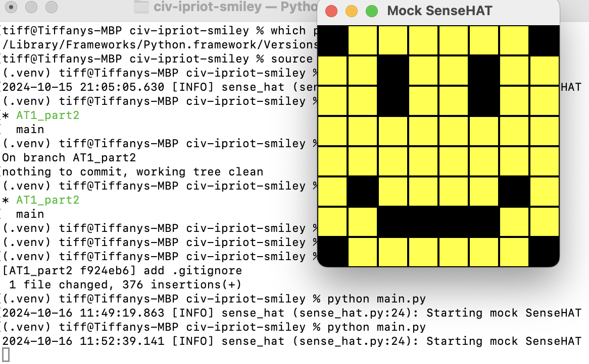
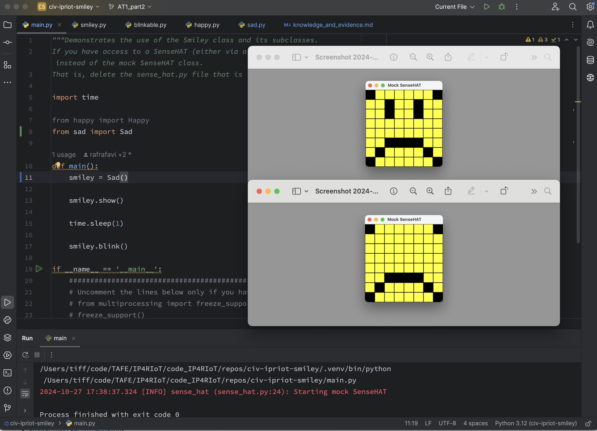
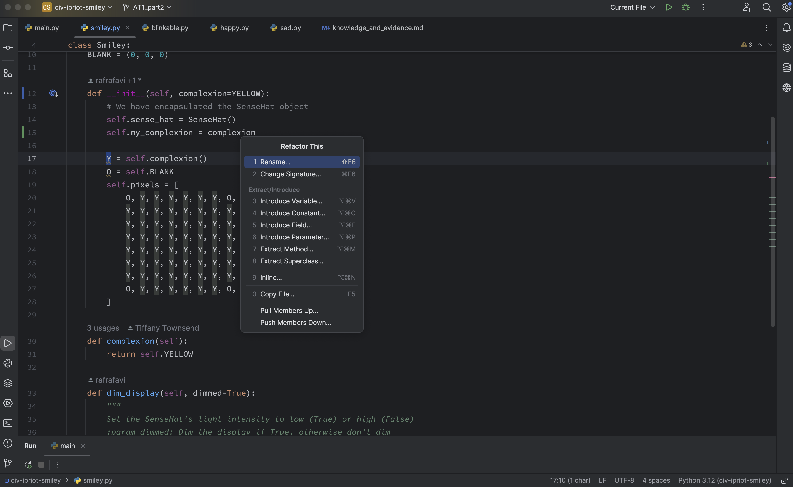

<style>

body {
    counter-reset: h2counter;
}

/* H1 - No numbering */
h1 {
    /* No counter reset or increment */
}

/* H2 - Level 1 numbering */
h2 {
    counter-reset: h3counter;
}

h2::before {
    counter-increment: h2counter;
    content: counter(h2counter) ". ";
}

/* H3 - Level 2 numbering */
h3 {
    counter-reset: h4counter;
}

h3::before {
    counter-increment: h3counter;
    content: counter(h2counter) "." counter(h3counter) " ";
}

/* H4 - Level 3 numbering (optional) */
h4 {
    counter-reset: h5counter;
}

h4::before {
    counter-increment: h4counter;
    content: counter(h2counter) "." counter(h3counter) "." counter(h4counter) " ";
}

</style>

# Evidence and Knowledge

This document includes instructions and knowledge questions that must be completed to receive a *Competent* grade on this portfolio task.

## Required evidence

### Answer all questions in this document

- Each answer should be complete, well-articulated, and within the specified word count limits (if added) for each question.
- Please make sure **all** external sources are properly cited.
- You must **use your own words**. Please include your full chat transcripts if you use generative AI in any way.
- Generative AI hallucinates, is not an authoritative source

### Make all the required modifications to the code

- Please follow the instructions in this document to make the changes needed to the code.

- When requested to upload evidence, upload all screenshots to `screenshots/` and embed them in this document. For example:

```markdown

```

- You must upload the code into your GitHub repository.
- While you can use a branch, your code should be in main when you submit.
- Upload a zip of this repository to Blackboard when you are ready to submit.
- You will be notified of your result via Blackboard
- However, if using GitHub classrooms, you may also receive additional feedback on GitHub directly

### Optional: Use of Raspberry Pi and SenseHat

Raspberry Pi or SenseHat is **optional** for this activity. You can use the included `sense_hat.py` file to simulate the SenseHat on your computer.

If you use a Pi, please **delete** the `sense_hat.py` file.

### Accessible version of the code

This project relies on visual patterns that appear on an LED matrix. If you have any accessibility requirements, you can use the `udl/accessible` branch to complete the project. This branch provides an accessible code version that uses text-based patterns instead of visual ones.

Please discuss this with your lecturer before using that branch.

## Specific Tasks & Questions

Address the following tasks and questions based on the code provided in this repository.

### Set up the project locally

1. Fork this repository (if not using GitHub Classrooms)
2. Clone your repository locally
3. Run the project locally by executing the `main.py` file
4. Evidence this by providing screenshots of the project directory structure and the output of the `main.py` file




If you are running on a Raspberry Pi, you can use the following command to run the project and then screenshot the result:

```bash
ls
python3 main.py
```

### Fundamental code comprehension

 Answer each of the following questions **as they relate to that code** supplied by in this repository (ignore `sense_hat.py`):

1. Examine the code for the `smiley.py` file and provide  an example of a variable of each of the following types and their corresponding values (`_` should be replaced with the appropriate values):

   | Type                    | name   | value           |
   |-------------------------|--------|-----------------|
   | built-in primitive type | dimmed | True            |
   | built-in composite type | WHITE  | (255, 255, 255) |
   | user-defined type       | Smiley | Smiley          |

2. Fill in (`_`) the following table based on the code in `smiley.py`:

   | Object                  | Type                  |
   |-------------------------|-----------------------|
   | self.pixels             | list (of tuples)      |
   | A member of self.pixels | tuple (of three ints) |
   | self                    | Smiley                |

3. Examine the code for `smiley.py`, `sad.py`, and `happy.py`. Give an example of each of the following control structures using an example from **each** of these files. Include the first line and the line range:

   | Control Flow | File      | First line          | Line range |
   |--------------|-----------|---------------------|------------|
   | sequence     | smiley.py | Y = self.YELLOW     | 15 - 26    |
   | selection    | sad.py    | if wide_open:       | 26 - 29    |
   | iteration    | happy.py  | for pixel in mouth: | 21 - 22    |

4. Though everything in Python is an object, it is sometimes said to have four "primitive" types. Examining the three files `smiley.py`, `sad.py`, and `happy.py`, identify which of the following types are used in any of these files, and give an example of each (use an example from the code, if applicable, otherwise provide an example of your own):

   | Type  | Used?     | Example                                      |
   |-------|-----------|----------------------------------------------|
   | int   | happy.py  | line 20: mouth = list of ints                |
   | float | happy.py  | line 33: delay=0.25                          |
   | str   | sad.py    | line 13: Draws the mouth feature on a smiley |
   | bool  | smiley.py | line 28: dimmed=True                         |

5. Examining `smiley.py`, provide an example of a class variable and an instance variable (attribute). Explain **why** one is defined as a class variable and the other as an instance variable.

> `WHITE` is a class variable and can be accessed by the class and by 
> instances of the class.  It will be the same for all instances of the 
> class and for any created subclasses. Changing the value of `WHITE` will 
> affect all Smileys instantiated after the change and all subclasses of 
> Smileys. So any Smileys or subclass of Smileys will use the same colour 
> settings when using WHITE.
> `pixels` is an instance variable (attribute) and is assigned when a class 
> is instantiated using the `__init__` method.  The `pixels` attribute is 
> defined by an instance of the Class and not by the class 
> itself. The value for `pixels` may be set for each instance of a Smiley 
> or subclass of Smiley so that they can have different colours as the 
> attribute is linked to the instance/self.
>

6. Examine `happy.py`, and identify the constructor (initializer) for the `Happy` class:
   1. What is the purpose of a constructor (in general) and this one (in particular)?

   > A constructor enables the initialisation of a new instance of a class.  
   > The Happy class constructor results in an instance of a Happy which is 
   > a subclass of a Smiley.
   >

   2. What statement(s) does it execute (consider the `super` call), and what is the result?

   > When the Happy class constructor initialises a new instance of the Happy 
   > class it calls the `super` method on the Smiley class. This results in 
   > the creation of a Happy with a SenseHat and with pixels set to the same
   > values of the parent Smiley Class (ie YELLOW face pixels with BLANK 
   > corners). It then calls the Happy class method draw_mouth and draw_eyes which changes the value of some of the pixels of the new instance to create a mouth shape specific to the Happy subclass of Smiley.
   >

### Code style

1. What code style is used in the code? Is it likely to be the same as the code style used in the SenseHat? Give to reasons as to why/why not:
   
> The code style used in the code is PEP8.  
> It is likely to be the same as the code style used in the SenseHat 
> because the SenseHat module name `sense_hat` is snake_case, the class 
> name `SenseHat` is PascalCase, and the `sense_hat` attribute is also 
> snake_case, and this follows PEP8 convention.

2. List three aspects of this convention you see applied in the code.

> Sources: https://pep8.org and https://github.
> com/NM-TAFE/ipriot-nms-org-template/blob/main/org/code-style-guide.md
> - Use of four spaces per indentation level.
> - Method definitions inside a class are surrounded by a single blank line. 
> Use of blank lines in functions, to indicate logical sections.
> - Modules, methods, attributes, and instance names have lower case names 
    > using snake_case. Class names use CapWords. Constants in ALLCAPS.
>

3. Give two examples of organizational documentation in the code.

> - Use of docstrings eg in the smiley.py module the docstring gives a 
    > description of the `dim_display` attribute.  The information in this 
    > docstring is available when the smiley module is imported elsewhere 
    > (eg to the happy module) by calling `help(Smiley.dim_display)`.
> - Use of comments and comment blocks eg in main.py there is a comment 
    > block that gives instructions on when lines of code should be 
    > uncommented (and thereby executed when the code is run).
>

### Identifying and understanding classes

> Note: Ignore the `sense_hat.py` file when answering the questions below

1. List all the classes you identified in the project. Indicate which classes are base classes and which are subclasses. For subclasses, identify all direct base classes.
  
  Use the following table for your answers:

| Class Name | Super or Sub? | Direct parent(s)  |
|------------|---------------|-------------------|
| Happy      | Sub           | Smiley, Blinkable |
| Smiley     | Both          | object            |
| SenseHat   | Sub           | object, Smiley    |
| Sad        | Sub           | Smiley            |
| Blinkable  | Both          | ABC               |
| ABC        | Both          | object?           |

2. Explain the concept of abstraction, giving an example from the project (note "implementing an ABC" is **not** in itself an example of abstraction). (Max 150 words)

> Abstraction simplifies code by "hiding away" the complexity of the 
> implementation details. The Blinkable class in the project demonstrates 
> abstraction as it takes the details of blink method and enables it be be 
> implemented in different ways by different subclasses. If a subclass 
> of smiley has implemented the Blinkable interface you can make that 
> subclass blink simply by calling the blink method without needing to know 
> the implementation details for that particular subclass of smiley.

3. What is the name of the process of deriving from base classes? What is its purpose in this project? (Max 150 words)

> Deriving from base classes is called inheritance.  In this project 
> inheritance is used to enable code reuse in subclasses of Smileys ie 
> Happy and Sad. Subclasses of Smiley each have a SenseHat and share the 
> same shape and colour as each other without the need to copy and paste or 
> rewrite the code for each new subclass/type of Smiley.
>

### Compare and contrast classes

Compare and contrast the classes Happy and Sad.

1. What is the key difference between the two classes?
   > The Happy class has a blink method (implemented via the Blinkable 
   > interface). The Sad class does not have a blink method. Therefore 
   > Happy Smileys can blink and Sad Smileys cannot blink.
   >
2. What are the key similarities?
   > Both the Happy and Sad classes inherit from Smiley and share the same 
   > Smiley shape and colour and have a SenseHat enabling the display of 
   > smiley objects. They both have their own implementations of draw.mouth 
   > and draw.eyes methods.
   >
3. What difference stands out the most to you and why?
   > The lack of inheritance of the Blinkable interface by the Sad Smiley. 
   > It seems like the blink function is something that you would want all 
   > Smileys to be able to do and the Sad Smiley is missing this method.  
   > If the Blinkable interface had been inherited by Sad then it would 
   > have required the blink method to be implemented.
   >
4. How does this difference affect the functionality of these classes
   > Some Smileys are able to blink and some are not able to and it is not 
   > known until you look at the code or execute the program which Smileys 
   > can blink and which cannot.
   >

### Where is the Sense(Hat) in the code?

1. Which class(es) utilize the functionality of the SenseHat?
   > Smileys and classes that inherit from Smiley (ie Smiley subclasses: 
   > Happy and Sad).
   >
2. Which of these classes directly interact with the SenseHat functionalities?
   > None of them.  Interactions with the SenseHat are done via the 
   > SenseHat instance that each Smiley has. The show method in the 
   > Smiley class calls the SenseHat class set_pixels method on the Smiley 
   > instance's SenseHat instance. The dim_display method in the 
   > Smiley class calls the SenseHat class low_light method on the Smiley 
   > instance's SenseHat instance.
   >
3. Discuss the hiding of the SenseHAT in terms of encapsulation (100-200 Words)
   > Hiding of the SenseHat protects instances of the SenseHat from being 
   > modified outside of the class.  This means that when changes are made 
   > to the SenseHat's state (ie it's attributes) they are done within the 
   > class and so this protects against changes being made that are 
   > incompatible with a SenseHat object (for example maybe trying to change 
   > the pixel settings to something other than rgb values).  Encapsulation 
   > of the SenseHat module also means it can be tested independently of 
   > the Smileys which can help with isolation of bugs in the program.
   >

### Sad Smileys Can’t Blink (Or Can They?)

Unlike the `Happy` smiley, the current implementation of the `Sad` smiley does not possess the ability to blink. Let's first explore how blinking has been implemented in the Happy Smiley by examining the blink() method, which takes one argument that determines the duration of the blink.

**Understanding Blink Mechanism:**

1. Does the code's author believe that every `Smiley` should be able to blink? Explain.

> No.  If the author believed every Smiley should be able to blink then they would have implemented an abstract method into the Smiley class so that a blink method would be required to be implemented with the creation of all new Smileys. 
>

2. For those smileys that blink, does the author expect them to blink in the same way? Explain.

> No.  If the author expected all Smileys to blink in the same way they would have made the blink method in the Blinkable class a concrete method but they have made it an abstract method so that the method can be implemented in different ways by subclasses that inherit this interface.
>

3. Referring to the implementation of blink in the Happy and Sad Smiley classes, give a brief explanation of what polymorphism is.

> Polymorphism allows for the blink method to be implemented in different ways for different subclasses of smileys. Currently, the Sad Smiley does not have a blink method but this method could be added to the Sad Smiley using a similar implementation as the Happy smiley via inheritance with the Blinkable interface, or it could be done with a Sad class method specific to Sad smileys.  If a blink method was implemented for the Sad smiley then blink could be called for both Happy and Sad smileys and they would both be able to blink but they might do it in different ways.
>

4. How is inheritance used in the blink method, and why is it important for polymorphism?

> Happy inherits the blink interface from Blinkable.  Inheriting this interface requires that the abstract method blink be implemented in the Happy class.  The specifics of how blink is implemented by subclasses that inherit Blinkable may be unique for each subclass but after it is implemented the method is called in the same way for each subclass, ie by calling the method blink.
>
1. **Implement Blink in Sad Class:**

   - Create a new method called `blink` within the Sad class. Ensure you use the same method signature as in the Happy class:

   ```python
   def blink(self, delay=0.25):
       pass  # Replace 'pass' with your implementation
   ```

2. **Code Implementation:** Implement the code that allows the Sad smiley to blink. Use the implementation from the Happy Smiley as a reference. Ensure your new method functions similarly by controlling the blink duration through the `delay` argument.

3. **Testing the Implementation:**

- Test the new blink functionality on your Raspberry Pi or within the Python classes provided. You might need to adjust the `main.py` script to incorporate Sad Smiley's new blinking capability.

Include a screenshot of the sad smiley or the modified `main.py`:



- Observe and document the Sad smiley as it blinks its eyes. Describe any adjustments or issues encountered during implementation.

  > I initially forgot to import the time module into the sad module resulting in a NameError as time was not defined in this module.  This resulted in the Sad Smiley being unable to complete the blink method.

  ### If It Walks Like a Duck…

  Previously, you implemented the blink functionality for the Sad smiley without utilizing the class `Blinkable`. Assuming you did not use `Blinkable` (even if you actually did), consider how the Sad smiley could blink similarly to the Happy smiley without this specific class.

  1. **Class Type Analysis:** What kind of class is `Blinkable`? Inspect its superclass for clues about its classification.

     > Blinkable is an Abstract Base Class.

  2. **Class Implementation:** `Blinkable` is a class intended to be implemented by other classes. What generic term describes this kind of class, which is designed for implementation by others? **Clue**: Notice the lack of any concrete implementation and the naming convention.

  > Blinkable is an interface. It has an abstract method, and no concrete methods and the name ends in the suffix -able.

  3. **OO Principle Identification:** Regarding your answer to question (2), which Object-Oriented (OO) principle does this represent? Choose from the following and justify your answer in 1-2 sentences: Abstraction, Polymorphism, Inheritance, Encapsulation.

  > Polymorphism - the implementation of the blink method can be different for each subclass that inherits the Blinkable interface.

  4. **Implementation Flexibility:** Explain why you could grant the Sad Smiley a blinking feature similar to the Happy Smiley's implementation, even without directly using `Blinkable`.

  > The Sad Smiley could have had the blink method implemented without the use of Blinkable (ie removing the inheritance of Blinkable still leaves the blink method and will result in the same display to the SenseHat).  The inheritance of Blinkable just meant that the blink method HAD to be implemented in the Sad class.  But all that was needed in order for the Sad Smiley to be able to blink was a blink method.

  5. **Concept and Language Specificity:** In relation to your response to question (4), what is this capability known as, and why is it feasible in Python and many other dynamically typed languages but not in most statically typed programming languages like C#? **Clue** This concept is hinted at in the title of this section.

  > This is known as Duck Typing. The focus of Duck Typing is on what an object can do rather than what the type of the object is. In statically typed languages types are much more important as the compiler needs to know that the specific types can all support the method. In Python all that is needed is for an object to have the method blink (regardless of the class/type) and the object will blink.  In a statically typed language the compiler would specifically need to know that the Sad can blink, and the Happy class can blink.

  ***

  ## Refactoring

  ### Does a Smiley Have to Be Yellow?

  While our current implementation predominantly features yellow smileys, emotional expressions like sickness or anger typically utilize colors like green, red, or orange. We'll explore the feasibility of integrating these colors into our smileys.

  1. **Defined Colors and Their Location:**

     1. Which colors are defined and in which class(s)?
        >Smiley class: colours (WHITE, GREEN, RED, YELLOW, BLANK). 
     2. What type of variables hold these colors? Are the values expected to change during the program's execution? Explain your answer.
        > The variable names of the colours (WHITE, GREEN, RED, YELLOW, BLANK) are capitalised which communicates their use as CONSTANTS therefore their values are not expected to change in the course of the program's execution. They value of the colour variables are tuples comprised of three integers.
     3. Add the color blue to the appropriate class using the appropriate format and values.

  2. **Usage of Color Variables:**

     1. In which classes are the color variables used?
        >Smiley class: Smiley complexion (YELLOW) and background (BLANK) pixels. Happy and Sad classes: mouth and eye colours.

  3. **Simple Method to Change Colors:**
  4. What is the easiest way you can think to change the smileys to green? Easiest, not necessarily the best!
     > Change the value of the YELLOW variable in the Smiley class to (0, 255, 0). This change will mean I don't need to change the draw_eyes methods in the Happy and Sad Smiley subclasses which are coded to use the YELLOW variable. It's a terrible idea as the name of the variable will no longer match with the output on the SenseHat but it will get the job done very easily. 

  Here's a revised version of the "Flexible Colors – Step 1" section for the smiley project, incorporating your specifications for formatting and content updates:

  ### Flexible Colors – Step 1

  Changing the color of the smileys once is straightforward, but it isn't very flexible. To facilitate various colors for smileys, it is advisable not to hardcode values in any class. This approach was identified earlier as a necessary change. Let's start by removing the built-in assumptions about color in our classes.

  1. **Add a method called `complexion` to the `Smiley` class:** Implement this instance method to return `self.YELLOW`. Using the term "complexion" instead of "color" provides a more abstract terminology that focuses on the meaning rather than implementation.

  2. **Refactor subclasses to use the `complexion` method:** Modify any subclass that directly accesses the color variable to instead utilize the new `complexion` method. This ensures that color handling is centralized and can be easily modified in the future.

  3. **Determine the applicable Object-Oriented principle:** Consider whether Abstraction, Polymorphism, Inheritance, or Encapsulation best applies to the modifications made in this step.

  4. **Verify the implementation:** Ensure that the modifications function as expected. The smileys should still display in yellow, confirming that the new method correctly replaces the direct color references.

  This step is crucial for setting up a more flexible system for color management in the smiley display logic, allowing for easy adjustments and extensions in the future.

  ### Flexible Colors – Step 2

  Having removed the hardcoded color values, we now enhance the base class to support dynamic color assignments more effectively.

  1. **Modify the `__init__()` method in the `Smiley` class:** Introduce a default argument named `complexion` and assign `YELLOW` as its default value. This allows the instantiation of smileys with customizable colors.

  2. **Introduce a new instance variable:** Create a variable called `my_complexion` and assign the `complexion` parameter to it. This step ensures that each smiley instance can maintain its own color state.

  3. **Rationale for `my_complexion`:** Using a distinct instance variable like `my_complexion` avoids potential conflicts with the method parameter names and clarifies that it is an attribute specific to the object.

  4. **Bulk rename:** We want to update our grid to use the value of complexion, but we have so many `Y`'s in the grid. Use your IDE's refactoring tool to rename all instances of the **symbol** `Y` to `X`. Where `X` is the value of the `complexion` variable. Include a screenshot evidencing you have found the correct refactor tool and the changes made.

  

  5. **Update the `complexion` method:** Adjust this method to return `self.my_complexion`, ensuring that whatever color is assigned during instantiation is what the smiley displays.

  6. **Verification:** Run the updated code to confirm that Smileys still defaults to yellow unless specified otherwise.

  ### Flexible Colors – Step 3

  With the foundational changes in place, it's now possible to implement varied smiley colors for different emotional expressions.

  1. **Adjust the `Sad` class initialization:** In the `Sad` class's initializer method, change the superclass call to include the `complexion` argument with the value `self.BLUE`, as shown:

     ```python
     super().__init__(complexion=self.BLUE)
     ```

  2. **Test color functionality for the Sad smiley:** Execute the program to verify that the Sad smiley now appears blue.

  3. **Ensure the Happy smiley remains yellow:** Confirm that changes to the Sad smiley do not affect the default color of the Happy smiley, which should still display in yellow.

  4. **Design and Implement An Angry Smiley:** Create an Angry smiley class that inherits from the `Smiley` class. Set the color of the Angry smiley to red by passing `self.RED` as the `complexion` argument in the superclass call.

  ***
